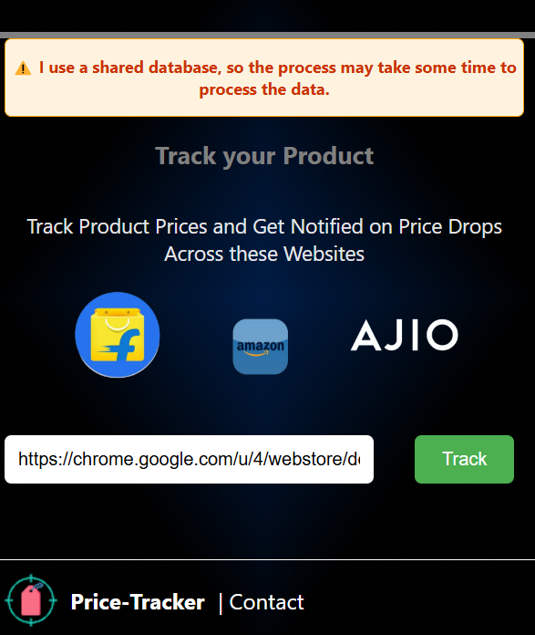
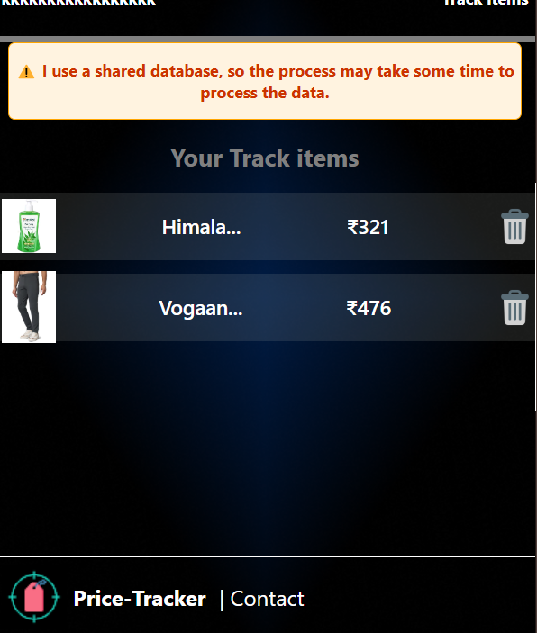

# Price Tracker Chrome Extension  

Track product prices effortlessly from Amazon, Flipkart, and Ajio with the Price Tracker Chrome Extension. Get real-time price updates, manage your tracked items, and save more on your online shopping!  

## Features  
- **Real-time Price Tracking:** Monitor product prices from popular e-commerce platforms.  
- **User Authentication:** Log in securely to manage your tracked items.  
- **Seamless UI:** Intuitive design for effortless navigation.  
- **Notifications:** Receive alerts when products are added to your tracking list.  

---

## How It Works  
1. **Log in** to the extension.  
2. **Navigate** to the product page you want to track on Amazon, Flipkart, or Ajio.  
3. **Click the "Track" button** in the extension to start monitoring the product price.  
4. Stay updated on price changes via notifications.  

---

## Screenshots  

### Main Page  
  

### Track Item Page  
  

---

## Technologies Used  
- **Frontend:** React.js, CSS  
- **Backend:** Node.js, Express.js, MongoDB  
- **Web Scraping:** Puppeteer  
